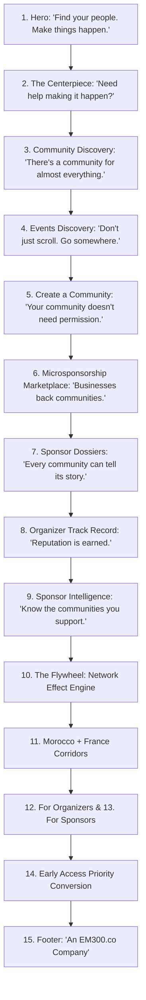

# JOINZY — Real-World Community Network & Microsponsorship Marketplace

> **An EM300.co Company**  
> Initial Launch Corridors: **Morocco** (Casablanca, Rabat, Marrakech, Tangier) & **France** (Paris, Lyon, Marseille, Bordeaux)  
> **Live Production**: [https://joinzy.vercel.app](https://joinzy.vercel.app)  
> **Repository**: [https://github.com/AberraouiTekypay/joinzy](https://github.com/AberraouiTekypay/joinzy)

---

## 1. Executive Summary & Core Thesis

**Joinzy is not another Meetup clone, an event management SaaS, or an advertising platform.**

Joinzy is the **infrastructure and marketplace for real-world communities**.

People already organize communities through WhatsApp groups, Instagram DMs, Facebook groups, and informal networks. Joinzy brings those communities into one structured, trusted platform where they can:
- **Create & grow communities** with zero paywalls.
- **Organize & discover gatherings** with transparent verified RSVP attendance.
- **Request & match with local resources** (venues, coffee, catering, photography, gear).
- **Receive micro-sponsorships** (cash grants or in-kind contributions) from local and enterprise businesses.
- **Build an immutable platform track record** based on measurable behavioral history (completion rates, attendance check-ins, zero last-minute cancellations).
- **Access permissioned community intelligence** for sponsors without surveillance or PII harvesting.

> *"Communities create the activity. Joinzy helps find the resources to make it happen."*

---

## 2. Brand Identity & Mediterranean Design Language

Joinzy's brand aesthetic is **editorial, Mediterranean, modern, energetic, and premium** — strictly avoiding generic B2B SaaS gradients, corporate stock photography, and neon gimmicks.

### Official Brand Palette

| Role | Color Name | Hex Code | Usage |
|---|---|---|---|
| **Primary** | **Charcoal** | `#1F1F1D` | Main text, wordmark body, navigation, dark backgrounds, high-contrast buttons |
| **Primary Accent** | **Terracotta** | `#E4572E` | Core brand accent, CTA buttons, active states, key metric highlights |
| **Secondary Accent** | **Sage** | `#688F3A` | Verified badges, attendance indicators, subtle community category tags |
| **Neutral Base** | **Warm Sand** | `#EDE6D9` | Main page background, card surfaces, warm warm-tone sections |
| **Neutral Border** | **Stone** | `#C9C9C9` | Clean structural borders, dividers, subtle separators |
| **Contrast Area** | **White** | `#FFFFFF` | Crisp contrast card bodies and form containers |

### Brand Rules & Principles
1. **Charcoal + Terracotta** define the core Joinzy identity.
2. **Sage** is an accent for trust and community health, not a dominant wash.
3. **Warm Sand** replaces cold grey across all backgrounds and card surfaces.
4. **No blue, purple, or neon gradients** — maintain organic, warm Mediterranean editorial sophistication.
5. **Logo**: The official `Joinzylogo.png` combines Charcoal with Terracotta accents on the `j` mark.

---

## 3. Product Architecture & Narrative Flow

The landing page is engineered around a strategic narrative that places **Resource Matching** directly after the Hero:



### Key Interactive Features

1. **Dual Currency Engine (`MAD` / `EUR €`)**:
   - Live context switcher in the navigation bar.
   - Automatically recalibrates all micro-sponsorship tiers and grant requests between Moroccan Dirham (`MAD`) and Euro (`€`).
2. **Interactive Resource Matching Sandbox**:
   - Users can toggle between **Venue**, **Food & Drinks**, **Cash Grant**, **Photography**, and **Prizes**.
   - Displays real-time matching between community requests and local business pledges with interactive pledge feedback.
3. **Live Community & Event Filters**:
   - Filterable by geography (Casablanca, Rabat, Marrakech, Paris, Lyon) and category vibe.
   - Live RSVP counter and attendance check-in status.
4. **Automated Sponsorship Dossier (Media Kit Preview)**:
   - Interactive tabs: *Executive Summary*, *Audience Demographics*, and *Activation Opportunities*.
   - Demonstrates how organizers get institutional-grade sponsor decks automatically generated from their platform ledger.
5. **Verified Behavioral Trust Ledger**:
   - Profile showcase of Amina El Mansouri (92% completion, 1,420 attendees, 0 cancellations, 6 repeat sponsors).
   - Replaces subjective 5-star ratings with verifiable platform metrics: *New* → *Established* → *Verified*.
6. **Sponsor Intelligence Mockup**:
   - Demonstrates aggregated cohort-level analytics across 27 communities and 14 events.
   - Strict privacy architecture: zero personal data selling, zero contact scraping.
7. **Early Access Waitlist with Digital Priority Pass**:
   - Role-based registration: Participant, Community Organizer, Sponsor, Venue/Business.
   - Instant celebratory confetti and custom Joinzy Batch #01 Priority Pass with one-click link sharing.

---

## 4. Business & Economic Model

| Stakeholder | Platform Pricing | Value Proposition |
|---|---|---|
| **Community Organizers** | **100% Free Forever** | Free community creation, event hosting, member audience growth, automated sponsorship dossiers, resource requests. Zero subscription fees. |
| **Participants** | **Free to Join** | Discover authentic local groups, attend free or paid events, build a verified attendance track record. |
| **Sponsors & Businesses** | **Per-Event Micro-Sponsorship** (No subscription required) | Sponsor single events starting at MAD 1,000 / €100 or provide in-kind resources (venues, coffee, gear) with guaranteed verified attendance. |
| **Enterprise / Multi-Event Sponsors** | **Future Intelligence Subscription** | Optional subscription tier for cross-community analytics, discovery, and demographic benchmarking. |

---

## 5. Technical Stack & Dependencies

- **Framework**: [Next.js](https://nextjs.org/) 16.3 (App Router with Turbopack)
- **Runtime**: React 19
- **Styling**: [Tailwind CSS](https://tailwindcss.com/) v4
- **Icons**: [Lucide React](https://lucide.dev/)
- **Micro-Interactions**: Canvas Confetti
- **Typography**: Space Grotesk (Headings) & Plus Jakarta Sans (Body)
- **Deployment**: [Vercel](https://vercel.com/) Edge Network
- **Version Control**: [GitHub](https://github.com/AberraouiTekypay/joinzy)

---

## 6. Local Development & Build Guide

### Prerequisites
- Node.js `v20+` or `v22+`
- npm `v10+`

### Installation & Run

```bash
# Clone the repository
git clone https://github.com/AberraouiTekypay/joinzy.git
cd joinzy

# Install dependencies
npm install

# Start development server
npm run dev
```

Open [http://localhost:3000](http://localhost:3000) in your browser.

### Production Verification Commands

```bash
# Run linting
npx eslint "src/**/*.{ts,tsx}"

# Run production build
npm run build

# Deploy to Vercel Production
vercel --prod --yes
```

---

## 7. Compliance & Attribution Requirement

In accordance with founding corporate guidelines:

```
An EM300.co Company
```

*Note: EM300.co is the parent entity. Do not alter to "by EM300" or "Powered by EM300".*
